(1/21) Initial Brainstorm

Brainstormed for modular educational tools and embedded sensor-driven systems. As a team, we brainstormed three primary tracks: 
- a plug-and-play ML educational platform. 
- AquaSense (a water quality monitoring system)
- PlantSense (a plant health diagnostics solution). 

Began surveying FPGA boards for potential use in hardware acceleration and real-time data processing. With the plug and play idea being the front runner, looked at different TPUs that we could use moving forward. Google Coral TPU seemed like a good lead. 

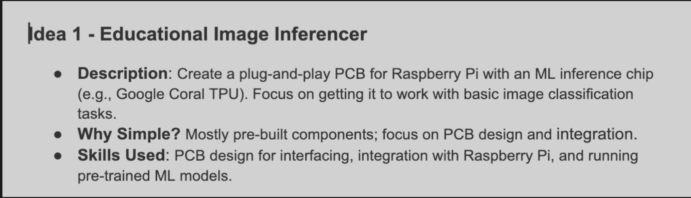

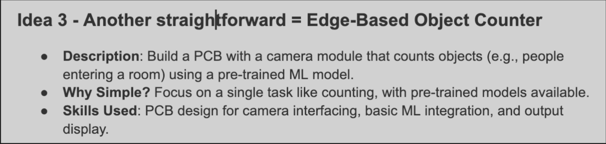
Figure 1: Initial brainstorming example ideas

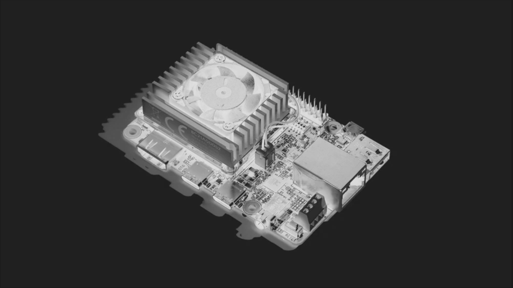
Figure 2: Google Coral TPU

I focused on researching different part options and evaluating them for integration into our plug-and-play ML educational model. Wanted to identify parts that strike a balance between cost, usability, and flexibility for beginners. I reviewed platforms including the Nandland Go Board, ESP32 and Digilent. Assessed these in terms of I/O expandability, documentation/tutorial support, and suitability for teaching digital logic or embedded ML acceleration. 

(1/24) KiCAD Development + Certifications

Focus was on building knowledge in PCB design using KiCad by prototyping a simple Encabulator circuit as a learning exercise. The team walked through both schematic design and PCB layouts; many of us here learned about KiCad for the first time with things like footprint management and component labeling. All ended up with a functional schematic and a completed board layout, with clear labeling and dimensioning suitable for fabrication.

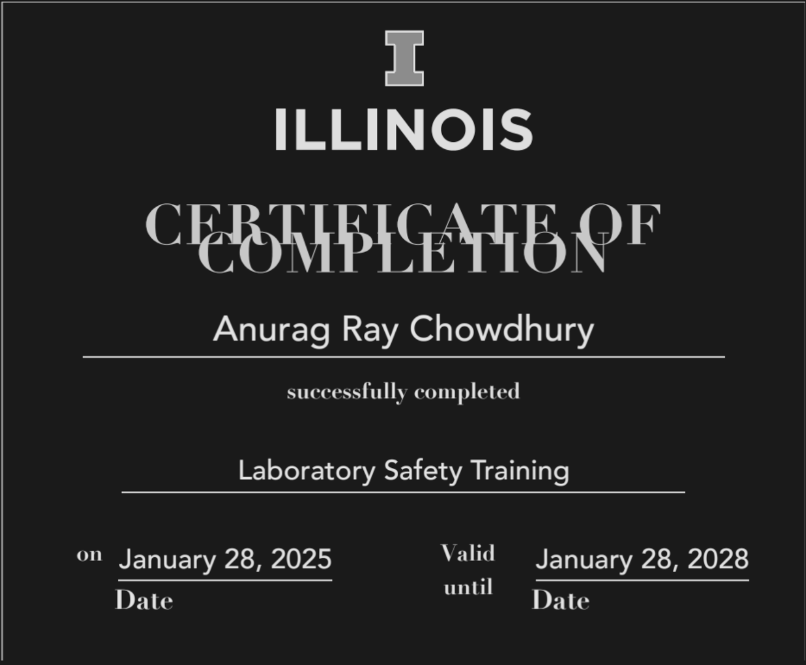
Figure 3: Safety Certification

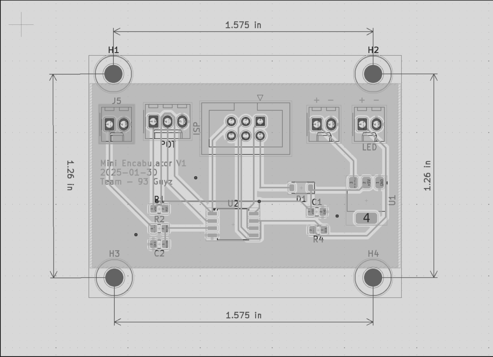
Figure 4: KiCad Encabulator Schematic + Design Progress

(2/7) Project Determination + Elaboration

We focused on refining the architecture for the project we eventually ended up going with (Aquasense) and outlining high-level requirements for our system.. We created a block diagram that positions the ESP32 microcontroller as the central hub, interfacing with pH, temperature, and dissolved oxygen sensors, all drawing from a shared power supply. Connectivity to the user interface will be handled via Wi-Fi or Bluetooth, supporting both mobile and web dashboards.

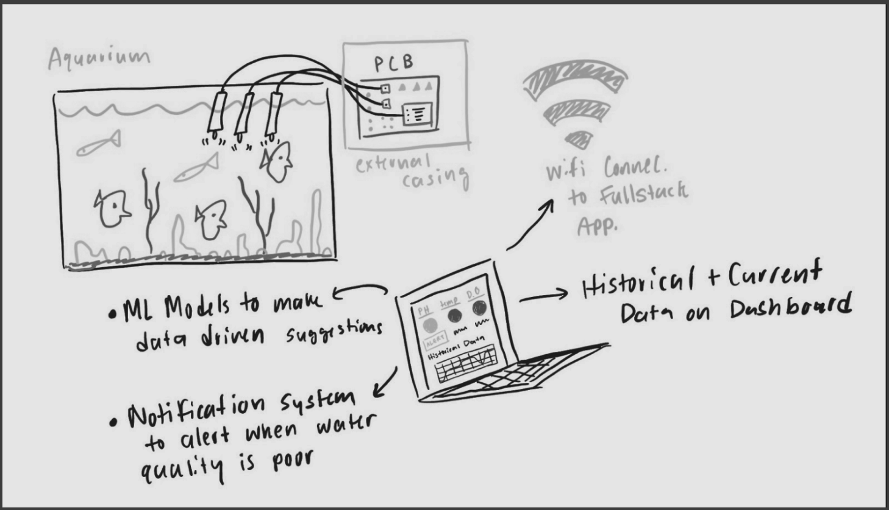
Figure 5: High Level Overview Initial Sketch

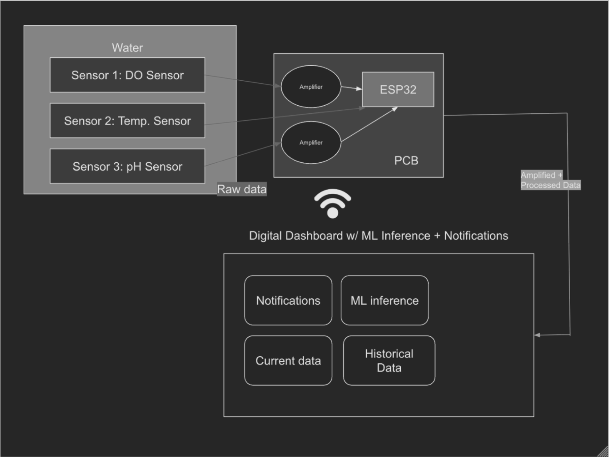
Figure 6: Basic Initial Block Diagram

Vout = (Vin * Rthermisto) / (Rthermistor + Rfixed)
Started to understand temperature and pH conditioning with V. Divider Equation

Started defining general High Level Requirements (HLRs):
- HLR-1: Continuous Monitoring – 15-second interval data logging for all key metrics
- HLR-2: Wireless Data & Alerts – Real-time threshold-based notifications
- HLR-3: Affordable & Simple Setup – Designed for non-technical users with a sub-$80 price point

I did a lot of my own research on the pH Sensing subsystem; plays a big role in maintaining and monitoring accuracy. I helped outline logic for adjusting pH thresholds dynamically based on environmental conditions like temperature (did research on which equations could work here). Wanted to minimize false alerts triggered by natural fluctuations in water conditions. I also began reviewing how these variables will be integrated with the ESP32’s processing pipeline to ensure consistent calibration behavior across different environments.

E = E0 - 0.0591/n * log[H+]

We used the Nernst equation to interpret the millivolt output of our pH sensor and convert it to hydrogen ion concentration.

(2/17) Team Contract + Long Term Vision

Focus was on formalizing team expectations and making sure everyone was on the same page for the core goals for our upcoming AquaSense project. Held discussions on project scope, system requirements, and individual responsibilities to ensure a smooth development process going forward.

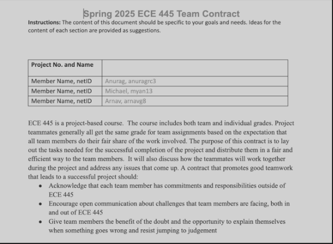
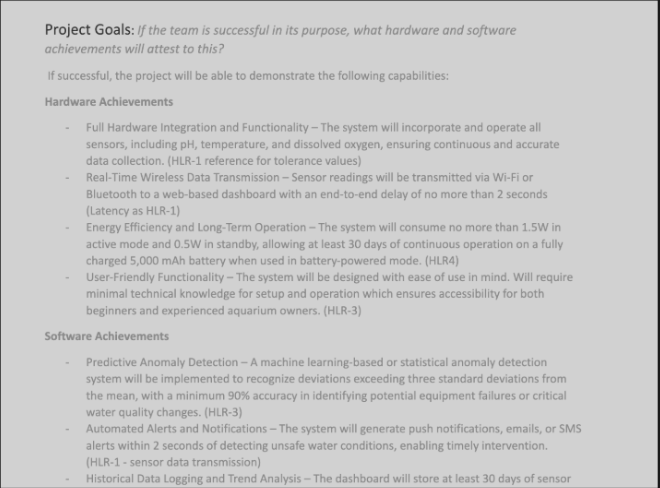
Figure 7: Snippets from Team Contract (example)

Project Vision & Goals:

We defined the high-level objectives for AquaSense, an ESP32-based water-quality monitoring system. 
- Continuously measure pH, temperature, and dissolved oxygen every 5–10 seconds with targeted accuracy (±0.2 pH, ±0.5 °C, ±0.5 mg/L).
- Wirelessly stream data to a cloud-based dashboard that includes real-time trend graphs and alert notifications.
- Incorporate basic machine learning for anomaly detection based on historical sensor data.
- Operate with low power consumption for at least 30 days on power.

These requirements reflect our desire to balance functionality with affordability and usability.

I helped to shape firmware and backend ideas for the project, outlining how the ESP32 will collect and transmit data, and how that data will be sent to the backend. I began mapping out the roles of the microcontroller, Node.js API layer, and eventual frontend integration to ensure that the firmware would support real-time monitoring. These early plans will guide my work as the firmware/backend lead going forward.

(3/7) Design Document + Parts Planning and Gathering
We began assembling our formal design document and producing early diagrams for AquaSense. We developed functional block diagrams to represent data flow between sensors, the ESP32 microcontroller, signal amplification stages, and the digital dashboard. Visualizations included both high-level component integration and sketches for the aquarium setup, sensor interface, and wireless data transmission to a full-stack web app.

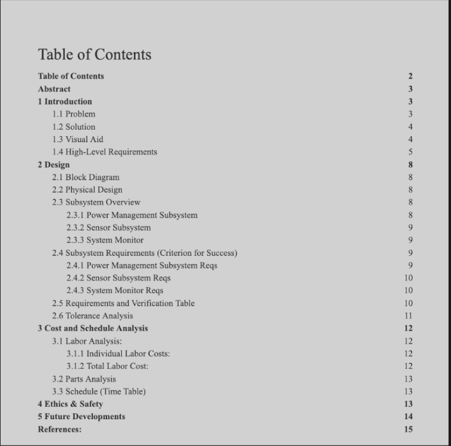
Figure 8: Initial Design Review Outline

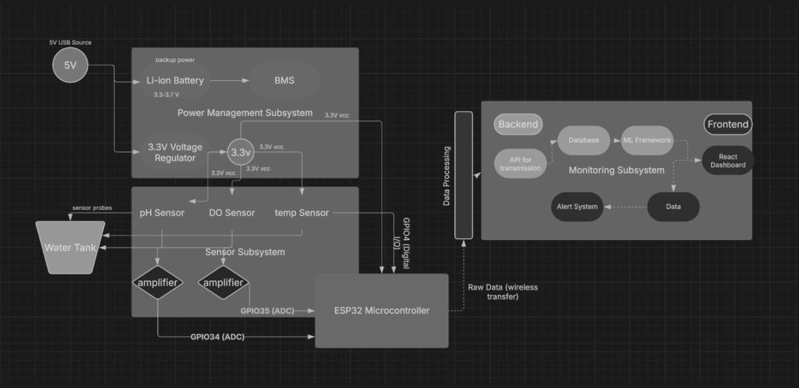
Figure 9: Initial Block Diagram in the Design Document

I focused on the firmware and hardware interfacing logic, particularly around interfacing with the ESP32 and pin planning. This pushed me to understand how raw analog signals from the pH and DO sensors would need to be conditioned before reaching the ESP32. Through analyzing sensor breakout boards with Michael, I found that pH and DO modules included a lot of pre-processing circuitry, unlike the simpler temperature sensor. As Michael and Arnav documented key conditioning techniques, we started thinking about some of the parts we would need to make this work.

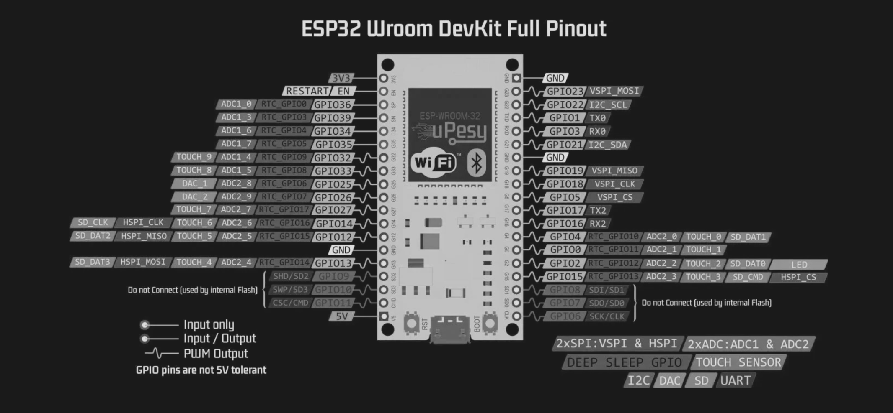
Figure 10: Pinout Used as Reference

I also began reviewing the ESP32-S3 module’s GPIO capabilities, identifying usable analog-capable pins while avoiding those (like ADC2 pins) reserved for internal Wi-Fi functionality. This groundwork is essential for planning clean PCB routing and ensuring reliable data acquisition when we transition to custom hardware.

Overall, still very research heavy, but there were a lot of moving pieces now and orders placed that would push us towards completing the project.

(3/11) pH Conditioning Board + Analysis

Began developing the full circuit design for AquaSense, with a focus on translating last week's signal conditioning research into a working solution. We specifically addressed how to handle and prepare the weak analog signals from the pH sensor to be read reliably by the ESP32’s ADC.
I worked on designing the pH signal conditioning circuit, trying to amplify the sensor’s millivolt-level output. Using a TL431 voltage reference and a resistor voltage divider, we biased the input signal around 1.25 V—ideal for the ESP32’s ADC range. The raw pH signal (originally spanning roughly -0.4 V to +0.4 V) is shifted to a range of ~0.83 V to ~1.65 V.

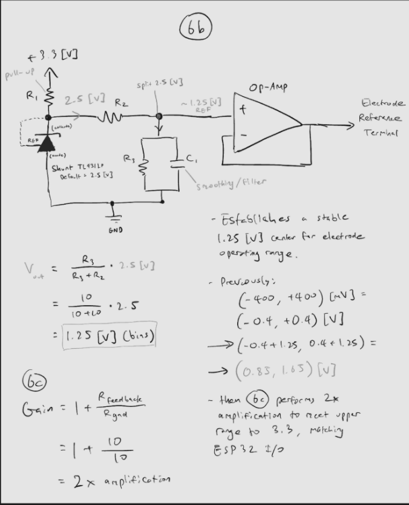
Figure 11: Calculations for pH circuit Amplifier

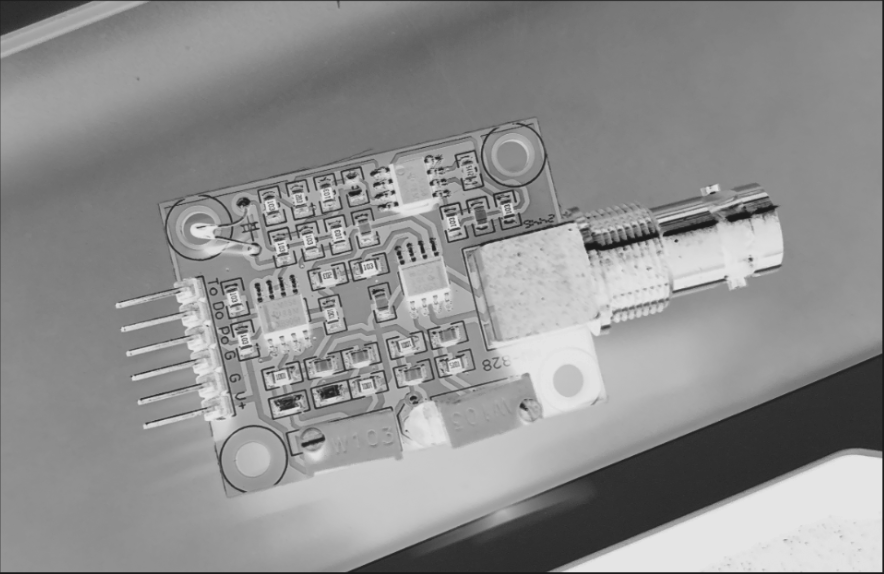
Figure 12: Signal Conditioning board for OUR pH Sensor

I did some early work with a non-inverting op-amp amplifier stage to perform a 2× gain on the centered signal. This extended the signal range to approximately 0.83 V – 1.65 V × 2 → 3.3 V max, ensuring full dynamic coverage of the ESP32’s 3.3 V input. We also added a capacitor for smoothing to reduce high-frequency noise and stabilize the input.

This was a key step in bridging the gap between raw sensor signals and usable digital data. 

(3/28) Schematic Finalization

Marked a major milestone in our hardware development process as we finalized the full schematic for the AquaSense PCB. Core circuit design locked in, our focus shifted to selecting appropriate footprints for all components in preparation for PCB layout.

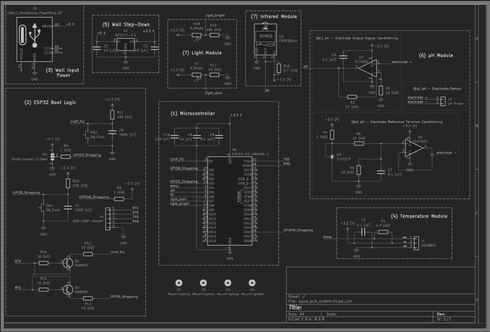
Figure 13: Final Schematic with Light Sensors Implemented

I worked on assigning and verifying footprints for all components in the schematic, ensuring each part matched a physically manufacturable and hand-solderable footprint. I prioritized the use of 0805 SMD packages for resistors and capacitors to strike a balance between compactness and ease of soldering. For ICs and connectors, I selected footprints like SOT-23 for transistors (e.g., S8050), QFN and SOIC packages for the op-amps (e.g., TLC4502), and standard BNC and terminal blocks for external sensor connections.

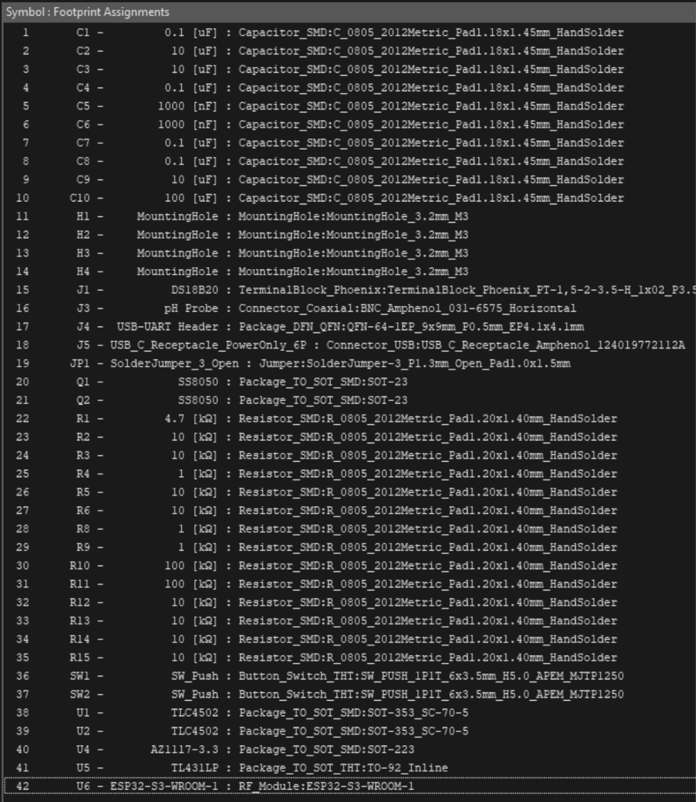
Figure 14: Footprints for all PCb Parts

This step ensures that our schematic is ready for PCB layout, and will allow us to proceed with board routing and component placement next week.

(4/4) Breadboard Implementation Finalization

Transitioned from schematic design to physical prototyping. We successfully implemented the final schematic on a breadboard, enabling full system-level integration and testing across all major subsystems.

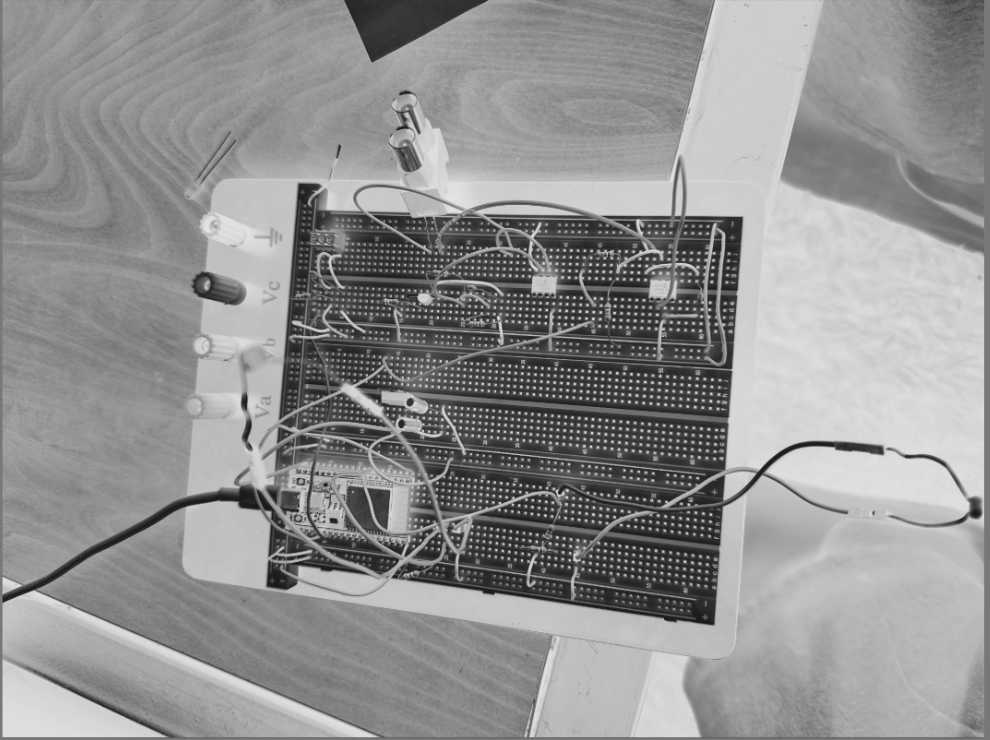
Figure 15: Breadboard Implementation of Schematic

I was involved in wiring and debugging the breadboard implementation, carefully translating our finalized schematic into a real-world circuit. This required validating each connection, handling signal routing across multiple sensors, and verifying voltage levels and signal behavior at each stage. 
We also began running verification tests based on our high-level requirements (HLRs), confirming that:
- The ESP32 can continuously read sensor values at the correct interval
- Amplified analog signals fall within the expected voltage range
- End-to-end data flow from the breadboard to the dashboard functions correctly

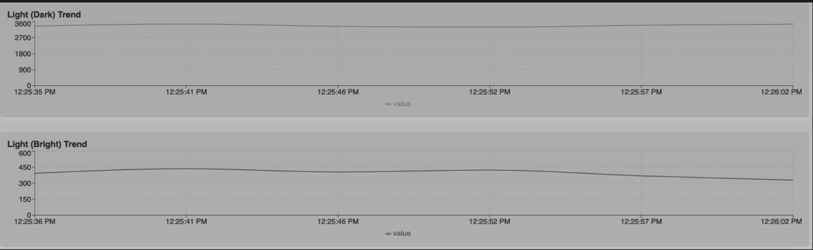
Figure 16: Stabilized Sensor Data (generic towards most fish tanks)

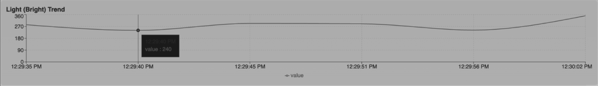
Figure 17: Example of sensor picking up different luminescences 

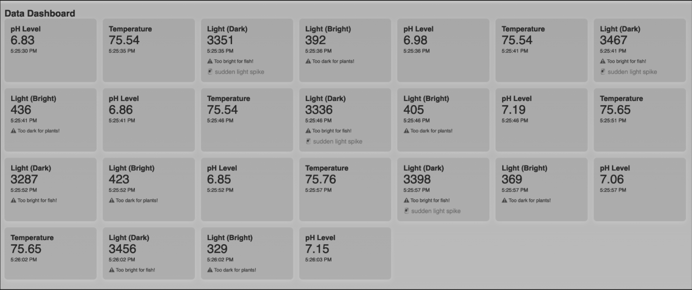
Figure 18: Data Dashboard

This successful milestone officially means our system is working end-to-end—from sensing, to signal conditioning, to data processing, and finally visualization.

(4/10) Backend Infrastructure Fine Tuning and Software Integration (full)

Worked on completing the interface between backend infrastructure and the front end that we had for the time being (fixing smaller issues). Built a local server-based system that the ESP32 could communicate with directly. The goal was to establish lightweight API endpoints that would accept sensor data over HTTP and pass it into our data pipeline for storage, visualization, and future ML processing. Had to refine these communication points for any points of failure that were creating errors. 

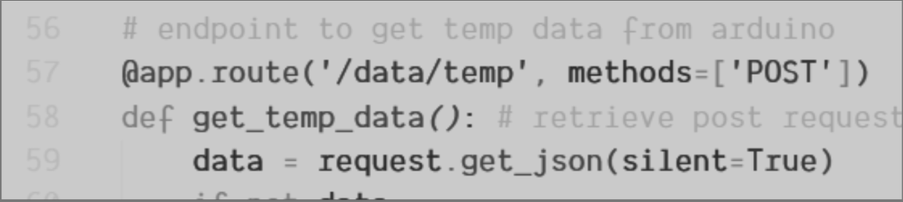
Figure 19: Temp. API endpoint

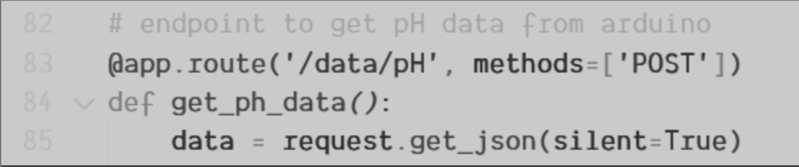
Figure 20: pH API endpoint

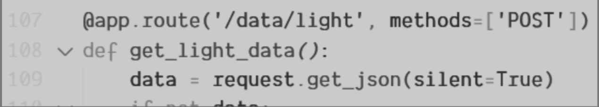
Figure 21: light API endpoint

I worked on getting basic routing logic in place using Flask, creating a simple /data POST endpoint that the ESP32 can hit directly. I focused on handling temperature readings—validating incoming JSON, logging them with a timestamp, and passing them to the backend storage function. I used this same logic for the other sensors once I could fully get temperature working. This setup lays the groundwork for a modular API design where we can easily extend functionality for pH, DO, and turbidity sensors. We kept the setup intentionally lightweight, running entirely on the local network for ease of debugging and development. Everything is now in place to begin integrating the full sensor stack with the backend.

(4/13) PCB Design Soldering + Software Progress

This week was dedicated to soldering components onto our custom-designed AquaSense PCB. With the finalized board delivered, we carefully populated the surface-mount and through-hole components using hand soldering techniques.

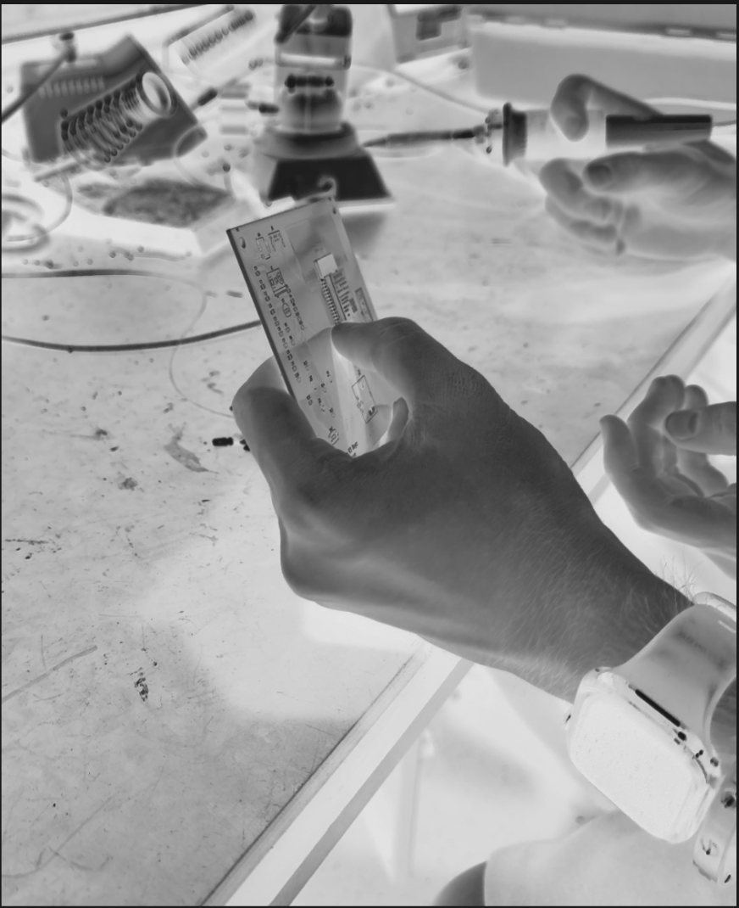
Figure 22: PCB Soldering Session

I assisted with the soldering and inspection of critical components, focusing especially on the analog front-end circuitry (e.g., op-amps, reference voltages, and signal conditioning paths for pH and light). We used multimeters and continuity tests to try and validate parts of the PCB, but we hit errors in connection components along the line. 

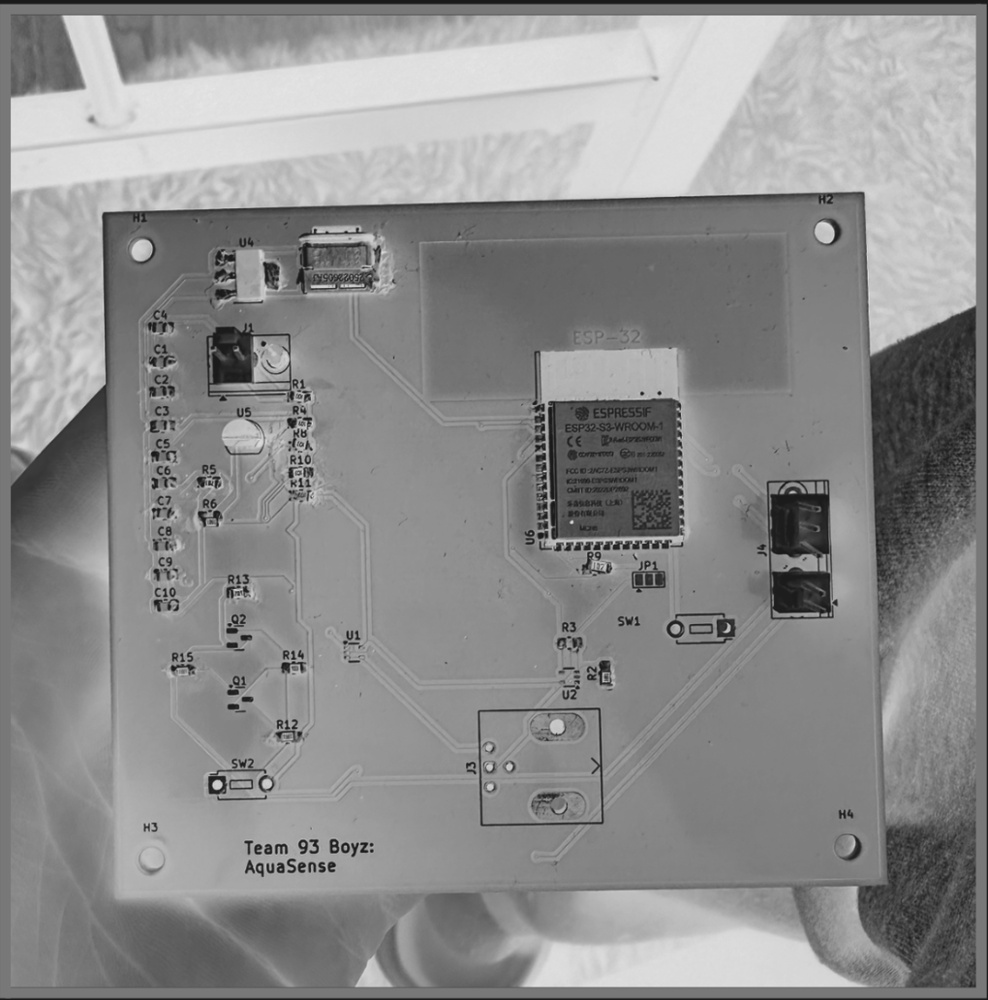
Figure 23: PCB Soldering Session Output

This marks the transition from prototyping to hardware validation on the final board—our system is now one step closer to being enclosure-ready.
We were running closer to the deadline at this point so we wanted to finalize the breadboard design before running into debugging work with the PCB.

(4/20) Software Progress (Machine Learning Implementation)

With all major components built and integrated, this week focused on finalizing the complete AquaSense system and tightening the overall development and deployment workflow. We aimed to smooth out any lingering inefficiencies in how data flowed from sensors to backend to dashboard. We also were able to use the machine learning algorithms we were researching (primarily other group members were doing so), and start implementing them into the front end. This would mark a full E2E integration of the hardware to the front end along with PCA anomaly detection based machine learning inference. 

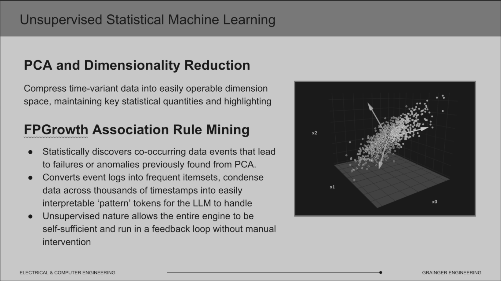
Figure 24: Presentation slide Explaining ML Algo + Output

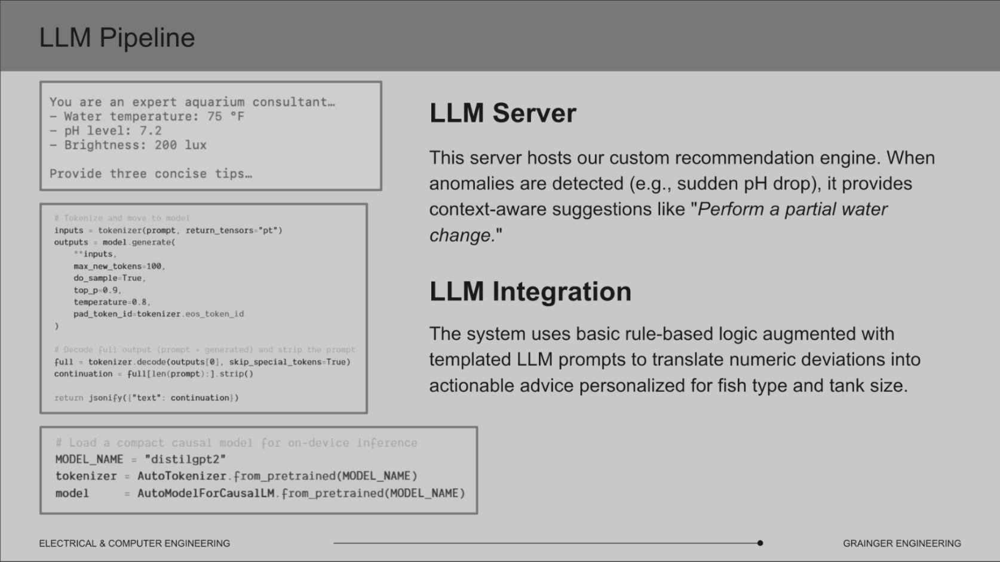
Figure 25: Presentation slide Explaining ML Algo + Output

I concentrated on streamlining the firmware-to-backend pipeline, ensuring data packets from the ESP32 were consistently formatted, timestamped, and routed to the API without delay. I also made adjustments to reduce redundant processing and improved error handling for intermittent connection drops. This helped eliminate delays between real-time sensing and dashboard updates.

Additionally, we reviewed our verification checklist one last time to confirm that all core functionalities—sensing, conditioning, transmission, display, and alerting—performed reliably under sustained testing conditions.
The AquaSense system is now fully operational and optimized for handoff or continued development.

(4/26) Mock Demo

This marks the final week of AquaSense development before our official demo. Most of our time was spent refining small details, testing the system under realistic usage conditions, and preparing for presentation.

I helped prep and walk through our mock demo with TA Michael, which provided extremely helpful feedback on both technical clarity and user experience. Based on his suggestions, we made note of areas to improve—such as refining the explanation of our ML anomaly detection logic, improving UI clarity on the dashboard, and highlighting real-time sensor response more effectively during the demo.
This session helped us validate that our system is not only functional end-to-end, but also presentation-ready.

