##Entry 1 (1/21)

Post lecture meeting. Brainstorming ideas, fleshing out initial details
Idea: modular Raspberry-pi powered project
Want to create a tool that can teach students how parallel computing works.
The motive is that high-performance computing (HPC) and GPU acceleration are the future and they power all the most cutting edge technologies because of how they optimize thread processing.
What level of performance do we need? What should the system be capable of demonstrating?
Image classification
Deep learning? 
Small-scale models
Parallelizable models
Consider using FPGA for hardware parallelism
Need a dedicated module to house co-processor (TPU) or some other low-power GPU

Google Coral TPU

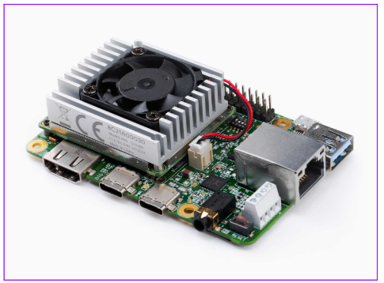

Upon first glance, this looks quite promising…
But we’ll need to design our pcb ourselves, this looks very involved

Let’s maintain alternative ideas in case this is too bold. 
But we are gonna try to go for the early project approval with this idea

Q: How do we illustrate “RAM”?
https://runtimerec.com/integrating-external-memory-with-fpgas-performance-optimization-techniques/#:~:text=On%2DChip%20Memory%20(BRAMs%2F,used%20for%20caching%20or%20buffering.
We can use the FPGA to do initial parallel preprocessing before sending it to the TPU.

“The project goal is to empower underprivileged communities with a hands-on, affordable ML learning tool. By providing access to advanced technology, this project can inspire the next gen of AI developers, particularly people who have historically been excluded from the tech revolution. Ideally, this tool could be used in partnership with educational institutions, nonprofits, and community centers to make ML widely available. It could be expanded further to even help create and distribute tailored resources for diverse learning environments.”

The PCB will be the crux of the system. It connects all the components together: Raspberry Pi, FPGA/ML accelerator (TPU), and camera (sensor input, can be replaced with anything).

Original idea scraps:

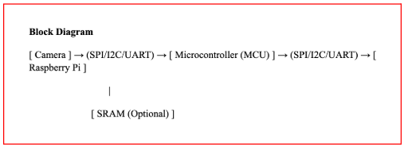
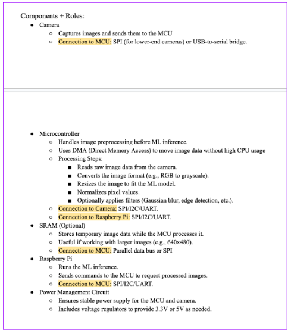

##Entry 2 (1/31)

Lab Safety Cert:

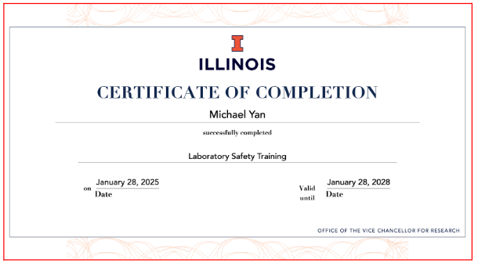

Today, getting re-familiarized with KiCAD and designing a circuit schematic like in ECE 385. 

Building an encabulator by walking through the process that is to be used for our own project later. It’s like a trial run using a smaller-scale PCB. Me and the team used KiCAD to build the logical circuit schematic for the encabulator, then also practiced exporting and converting this high-level schematic into a physical placement/routing design for the actual PCB to be printed. 

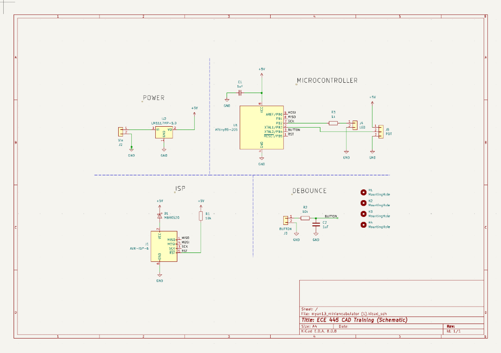
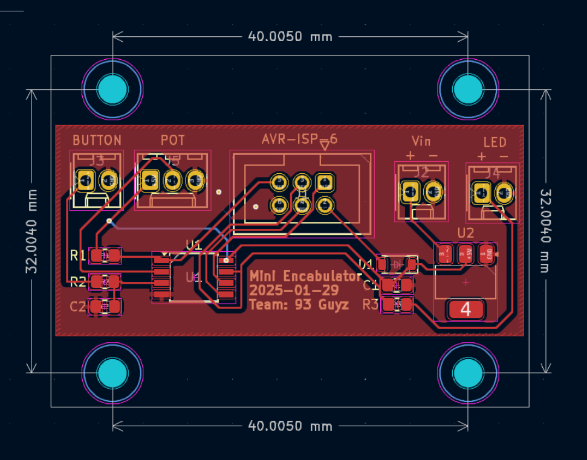

Ultimately, me and the group each built our own schematic and PCB files. This was great practice for the key skills needed for arguably the most important stages of the project for the semester.

##Entry 3 (2/5)

Formalizing the final project idea today. 

The TPU idea is too complex. It doesn’t really fit the scope of the project either. We are going to defer to a more PCB-centric project design that features a non-Raspberry Pi microcontroller

Specifically, the ESP32-WROOM-32 will serve as our main processing unit (microprocessor). Key features as per my preliminary research:
Dual-core CPU w/ low-power modes for active sensing and energy-efficient standby
Built in Wi-F and Bluetooth, simplifying real-time data transmission
ADC and UART/I2C interfaces, suitable for connecting a mix of analog/digital sensors

Our project is inspired by our groupmate Anurag’s home aquarium setup:

We are proposing a modular subsystem design to address the problem of intelligent aquarium health tracking for lazy or inexperienced owners. This works perfectly for our chosen microprocessor and its built-in support for multiple forms of input (analog vs digital)

We want to somehow uphold the ML aspect of our old idea, to carry it forth. We want multiple forms of input as a way of modelling the ‘state’ of our aquarium:

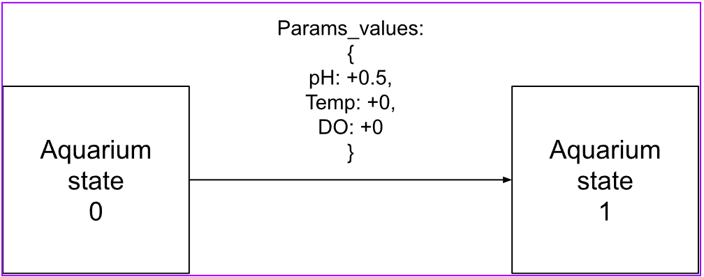

Some considerations…
We’ll need a sensor subsystem, monitor subsystem (user-facing interface), power management subsystem
The sensors likely won’t work out-of-the-box with our system. Need to do some kind of signal preprocessing
Waterproofing?
Full-stack application? 

Useful References
https://www.espressif.com/sites/default/files/documentation/esp32-wroom-32_datasheet_en.pdf

##Entry 4 (2/12)

Today, reflecting on long-term team goals and expectations as outlined in our initial team contract. Let’s also document the progress we’ve made so far on the project, AquaSense. (yes we’ve decided on the final name too)

We have determined the following goals for AquaSense to be deemed a success:
Monitoring of aquarium health drawn from key parameters (pH, temperature, dissolved oxygen levels)
Wireless, real-time data transmission via Wi-Fi/bluetooth and observable on a cloud-based dashboard
ML based anomaly detection using user history data of the above params, to alert the system of dangers or abnormal behaviors.
30+ day battery runtime under low-power operation.

I personally will be focusing on integrating the sensors into the microprocessor and transforming, preparing the data to be sent to our full-stack app. 

I want to also focus on the baseline ML model, which currently I’m thinking of going with a random forest for simple anomaly detection trained on external data. Problem is we might not be able to find good model weights for our specific task. We might have to fabricate/synthesize our own data using just our specific parameters and constraints. 
Data collection and cleaning: log real-time sensor input using ESP32 and sync timestamps/metadata across subsystems, incoming signal noise filtering, 
Model training: training a Random Forest classifier on labeled data to differentiate normal vs abnormal aquarium conditions. Sklearn, XGboost libraries

Example training set snippet for anomaly detection, via Kaggle:

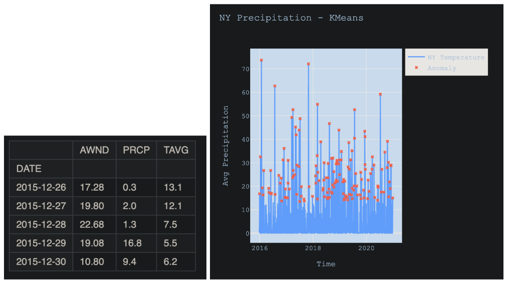

This is training for weather anomaly detection using historical weather data, similar in principle to our project. Would just need to substitute in our own parameters. Speaking of which, we’ve narrowed them down to three candidates:

pH sensor: critical parameter that directly affects fish metabolism, immune response, and biological filtration → dramatic changes can stress or kill sensitive fish species
Temperature: affects fish metabolism, DO levels, and chemical behavior, varies per fish
DO: dissolved oxygen is essential for fish to breathe, and for their biological filtering abilities to function. They can suffocate and experience long-term health decline if this metric is not cared for.
A common theme here is that the needs of each metric vary by fish species a lot, we need to somehow find a way to automate the process of adjusting the requirements based on the user’s own aquarium. This is calibration, it can likely be done with software after doing the hardware calibration for the sensors themselves as a baseline.

Rough sketch of our current system ideation: 

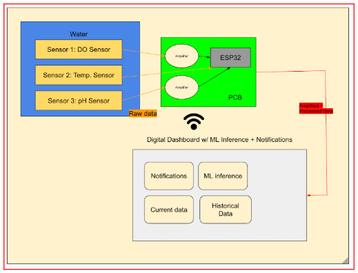

More references:
https://www.kaggle.com/code/sergiovirahonda/forecasting-and-anomaly-detection-on-weather

##Entry 5 (3/3)

We need to replicate the sensors’ breakout board conditioning logic on our own PCB… how do we approach the problem of signal conditioning? What are common tactics that are used for preparing a raw signal for digital manipulation?

Capacitors: useful for stabilizing high-noise or sensitive signals
Voltage reference: 

Not all sensors will be handled the same. I think pH and DO will be substantially harder than temperature. You can tell just by looking at the dev boards themselves that the sensors came with…

The breakout boards for pH and DO look pretty involved, I wonder what even needs to be done to the raw sensor’s signal… how hard could it be to turn that output into one that can fit the ESP? 

Here’s what we know so far:
ESP32 operates on a 3.3 V level
Interfaces via GPIO pins
GPIO pins are primarily for DIGITAL signals.
Apparently they can also do Analog-to-Digital conversion
Avoid ADC2 (GPIOs 0, 2, 4, 12, 13, 14, 15, 25, 26, 27) because the ESP Wi-Fi subsystem relies on them in-house.

##Entry 6 (3/7)

We are in the midst of developing the big circuit design. Trying to consolidate all the information we gathered last week about signal conditioning and make something that will work for our system. 

Handling pH sensor
Low Signal Strength:
Output typically in the millivolt range.
Requires high-precision ADC or external amplification.
Negative Voltage (pH sensors):
ESP32 ADC cannot handle negative voltages directly.
Requires level-shifting using an op-amp to bring signals into 0–3.3V range.
Calibration Complexity:
Readings depend on calibration against reference solutions.
Vary significantly with temperature and require compensation formulas.
Noise Sensitivity:
Small signal changes make the system susceptible to electrical noise.
Careful circuit design and shielding are essential.

Compared to temperature for example:
Output in wider voltage range → easier to read
Often includes internal compensation for non-linearity
In-house analog to digital conversion.

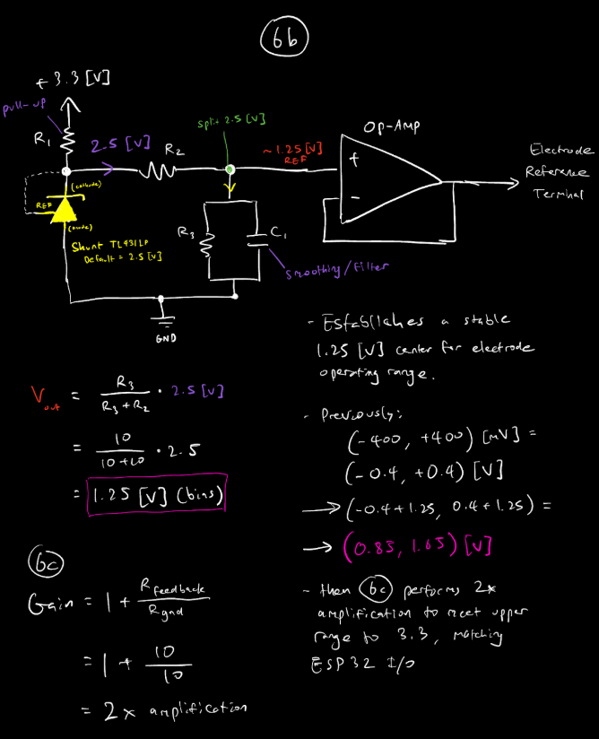

This is what we came up with today for the pH sensor

We’re thinking that for the breadboard demo, we will demonstrate the sensors paired with the breakout dev boards they came with (so our system can be shown working end-to-end, with simplified circuit hardware).

##Entry 7 (3/28)

Finalizing schematic design:

Choosing footprints for PCB –

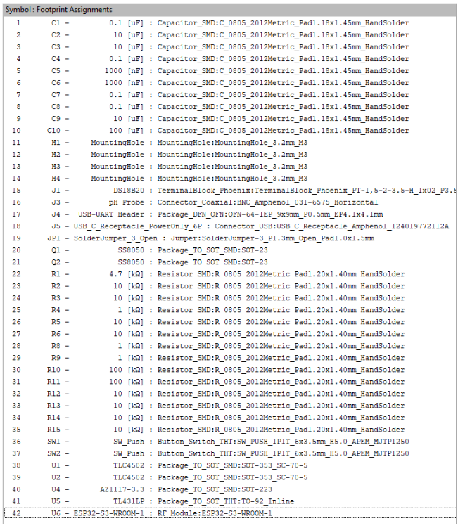

Intense breadboard progress.
Rigorous Testing with regards to our requirements and verification.

We have just fully implemented the final schematic on our breadboard!
It’s been connected and our system officially now works end-to-end.

Breadboarding Milestone Achieved:

All core subsystems have now been implemented and tested individually on the breadboard:

Power Management: Verified regulated 3.3V and USB-C connectivity via AZ1117 and TL431LP.

Sensor Interfaces: pH, temperature, and light sensors successfully interfaced with ESP32 using analog amplification circuits (with op-amp TLV2372).

Digital Logic & I/O: Buttons, UART communication, and sensor toggling logic validated via GPIO control.

Data Flow: Sensor readings accurately pushed to backend via WiFi, confirming integrity of ESP32 firmware and Flask endpoints.

Checklist:
[✔] Schematic complete
[✔] Circuit tested on breadboard
[✔] Firmware communicating successfully
[✔] API integration confirmed
[✔] Real-time dashboard is live.

##Entry 8 (4/7)

Setting up API routes for the system’s backend… building a simple ecosystem that lies purely on the local network, and exposes an endpoint for the ESP32 to hit directly.

This is how our routing works

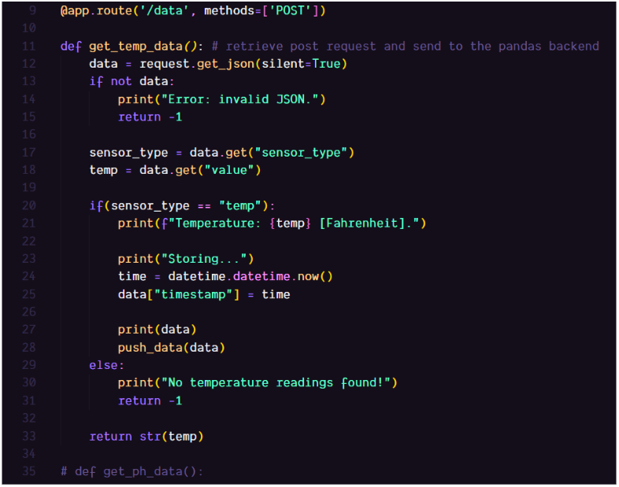

Testing Approach:
Simulated Data Injection: We created test POST requests mimicking ESP32 payloads for temp, pH, and light using requests.post().

Timestamps were auto-generated server-side to reflect real-time logging.

Backend Verification:

Each POST endpoint (/data/temp, /data/pH, /data/light) confirmed successful storage by printing diagnostic output to the console and pushing structured data to the in-memory DataFrame.

Visualization Pipeline:

After accumulation of 30 mock entries over simulated 5-minute intervals, we plotted the trends below to ensure the system captures, timestamps, and distinguishes between sensor modalities correctly.
